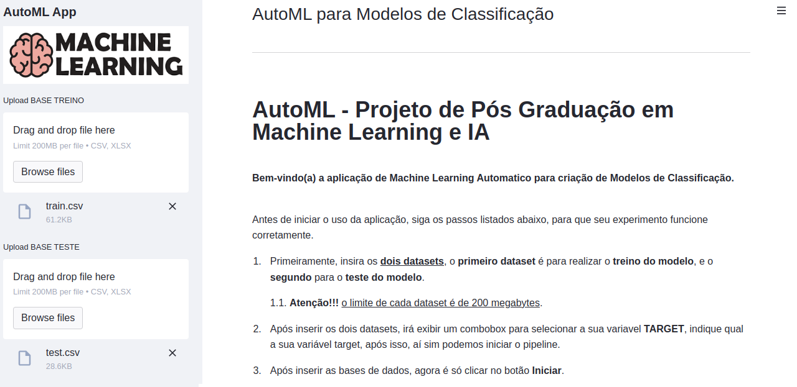

# FastML - Projeto de Pós Graduação em Machine Learning e IA

 

**Bem-vindo(a) a aplicação de Machine Learning Automatico para criação de Modelos de Classificação.**

  

### **FastML é uma ferramenta que usa Automated Machine Learning (AutoML) para criação automatizada de Modelos de Classificação, tudo utilizando uma interface amigável e, permitindo com poucos cliques, a prototipação rápida de modelos para problemas de classificação.**

  

Esse projeto foi desenvolvido para conclusão da Pós Graduação em Machine Learning e IA da PUC Minas, pela aluna Andressa Marçal.

 

 

Principais bibliotecas utilizadas no projeto:
1. PyCaret
2. Streamlit

 

**Para rodar a aplicação locamente, primeiro baixe o repositorio na sua máquina, depois utilize o seguinte comando:**

1. `docker build . -t pycaret`
2. `docker run pycaret` 